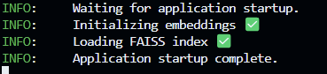
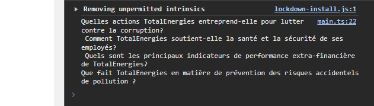

# PROTO RAG-DEPLOYER 

## Overview
This project consists of two main components:
1. **FRONT**: The front-end of the application, built using Node.js.
2. **BACK**: The back-end of the application, built using Python and FastAPI.

Follow the steps below to set up and run the project.

---

## Prerequisites
- **Python**: Version 3.9 or higher.
- **Node.js**: Version 16 or higher.
- **NVIDIA GPU**

---

## Installation

### 1. Clone the Repository
Clone the project repository to your local machine:
```bash
git clone https://github.com/CorentinPRADIE/RAG-DEPLOYER.git
cd RAG-DEPLOYER
```

---

### 2. Back-End Setup
1. **Navigate to the Back-End Directory**:
```bash
cd BACK
```

2. **Install Python Dependencies**:
   Install the required Python packages listed in `requirements.txt`:
```bash
pip install -r requirements.txt
```

---

### 3. Front-End Setup
1. **Navigate to the Front-End Directory**:
```bash
cd FRONT
```

2. **Install Node.js Packages**:
   Install the required Node.js dependencies:
```bash
npm install
```

---

## Usage

### Starting the Project
You will need **two terminals** to run the project:

#### Terminal 1: Run the Back-End
1. Navigate to the `BACK` directory:
```bash
cd RAG-DEPLOYER/BACK
```

2. Start the FastAPI server:
```bash
uvicorn app.main:app --host 0.0.0.0 --port 5000 --reload
```

#### Terminal 2: Run the Front-End
1. Navigate to the `FRONT` directory:
```bash
cd RAG-DEPLOYER/FRONT
```

2. Start the development server:
```bash
npm run dev
```

---

### Accessing the Application
1. The **back-end** will be available at `http://localhost:5000`.
2. The **front-end** will be available at `http://localhost:3000`.

Open your browser and go to `http://localhost:3000` to use the application.

## Tips

### 1. Wait for the Back-End to Initialize
Make sure the back-end is fully initialized before interacting with the application. You should see the message **"Application startup complete"** in the back-end terminal before asking a question.



---

### 2. Example Questions in the Navigator Console
You can find examples of questions directly in the console of your browser (front-end).


